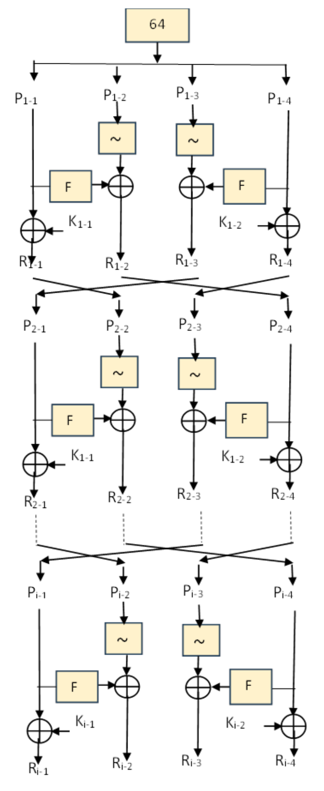
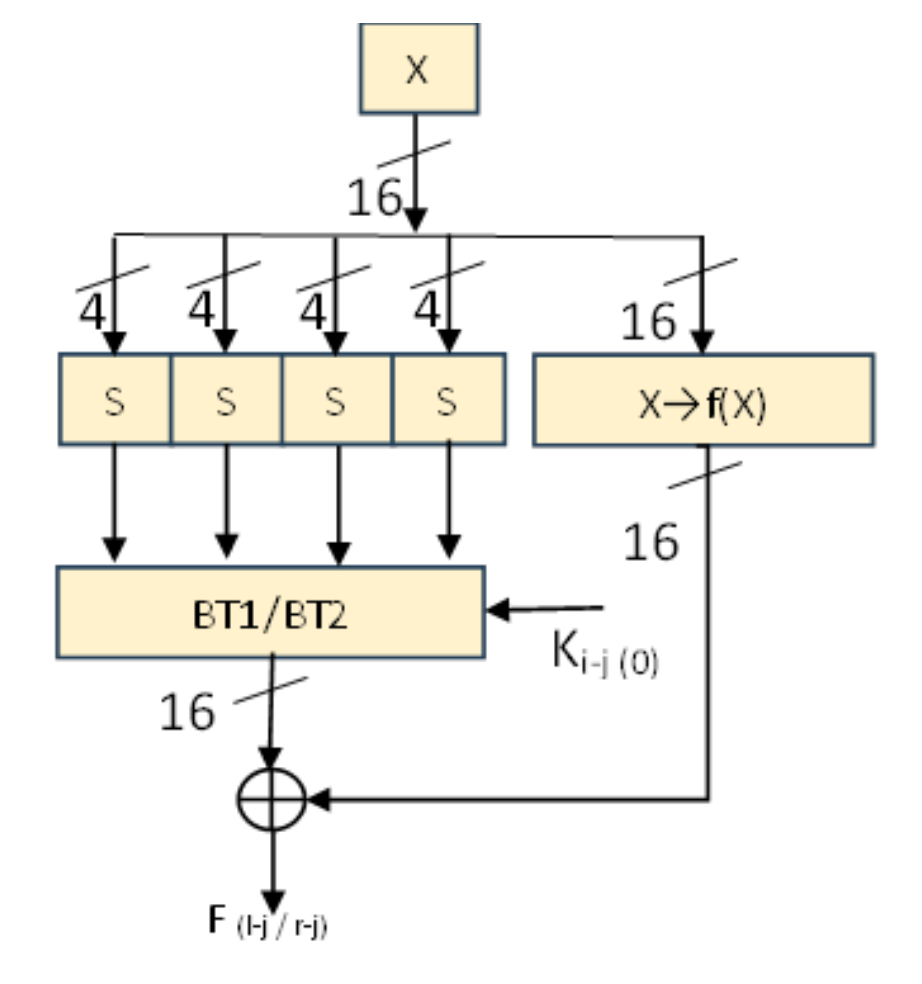
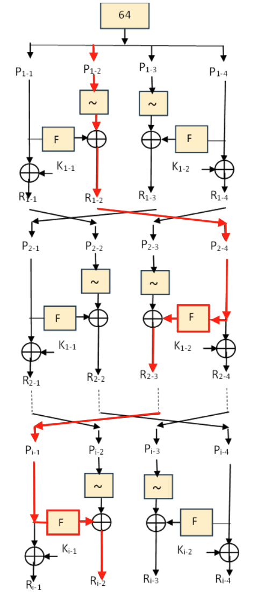

+++
date = '2026-05-26T00:36:00-07:00'
title = "How Much Should We Trust Purpose-Built Block Ciphers?"
summary = "On a critical flaw in the security analysis of NDN, an IoT-targeted block cipher published in IJCNA 2025"
math = true
+++

*On a critical flaw in the security analysis of NDN, an IoT-targeted block cipher published in IJCNA 2025*

---

## Motivation

My first encounter with cryptanalysis, particularly differential cryptanalysis, was Lukas Stennes's *[Breaking NATO Radio Encryption](https://youtu.be/v8Pma5Bdvoo?si=rudvrIG34ez35KeA)* talk at the 38th Chaos Communication Congress in 2024. Stennes presented an attack on **HALFLOOP-24**, a tweakable block cipher used by NATO and the US military to protect the automatic link establishment protocol in high-frequency radio. By introducing a chosen difference in the tweak, Stennes and his team built an attack that skips the first 5 of HALFLOOP-24's 10 rounds. As a result, key recovery time was reduced from roughly 500 years of intercepted traffic to about 2 hours.

That talk pulled me back into a question that I've been thinking about for a while: how much should we trust block ciphers purpose-built for embedded and IoT devices? As security engineers, we've been taught from day one to use only FIPS-approved algorithms. Yet, there're new ciphers coming out claiming to optimize for embedded devices, while achieving the same level of security. The block cipher I'm walking through below is, admittedly, a cherry-picked example. However, it shows how poorly validated these ciphers are and gives us a good reason to not deviated from FIPS-approved algorithms.

## NDN, An Ultra-Lightweight Block Cipher

**NDN** (Neural-Network Driven) is a 64-bit ultra-lightweight block cipher designed by Nagaraj Hediyal and Divakar B.P., [published in March 2025](https://www.ijcna.org/abstract.php?id=4748) in the *International Journal of Computer Networks and Applications* (vol. 12, issue 2). It comes in two configurations: an 80-bit key with 12 rounds, or a 128-bit key with 18 rounds. This ultra-lightweight block cipher can be categorized as [Feistel cipher](https://en.wikipedia.org/wiki/Feistel_cipher), where the round function is applied to only a portion of the data block in each round.

Under NDN, the 64-bit input block is sliced into four 16-bit chunks. For each round, chunk 1 and chunk 4 are fed through the F function (aka. round function), which contains the S-Boxes. The results from the F functions are then XOR'd back with bitwise NOT of either chunk 2 or chunk 3. At the end of the round, the four chunks rotate positions so different chunks get fed into the F function on the next iteration. Below is a screenshot taken from the paper showing the encryption schedule of NDN.

  

## The Missing Active S-Boxes

Central to a block cipher's security against differential attacks is its **Maximum Differential Probability (MDP)**. S-boxes (substitution boxes) are the core non-linear components in most modern block ciphers, regardless of whether they use a Feistel Network or a Substitution-Permutation Network architecture. A higher number of active S-boxes, in general, decreases the MDP and increases the security of the cipher. The paper interprets **active S-box** differently from the canonical definition, which led to a drastically higher MDP value than what the authors claimed.

In the paper, an active S-box is defined as the following:
>An S-box is active if at least one of its bit's changes during the encryption.

Following the logic of this definition, almost every S-box in the cipher would be counted as active, regardless of whether a differential trail actually passes through it. In contrast, active S-boxes are [defined canonically](https://dl.acm.org/doi/full/10.1145/3632871) as:
>S-boxes whose input differences are nonzero under two executions.

On the surface, it looks like a misinterpretation of what an active S-box is. However, NDN's calculation of MDP hinges on this flawed definition and led to an overstatement of NDN's security. Building on top of this flawed definition, the authors claim that:
>... any three consecutive rounds of the NDN cipher activate at least 15 S-boxes. 

With each S-box contributing $2^{-2}$ probability, the claimed 15 active S-boxes would give a MDP of $2^{-30}$ over 3 rounds and $2^{-120}$ over the full 12 rounds. If these values were true, then a MDP of $2^{-120}$ for a 64-bit block cipher would be well below the threshold of $2^{-64}$, making it theoretically immune to differential attacks.

However, using the canonical definition for active S-boxes, it is easy to find a scenario with only 4 active S-boxes over 3 rounds. This means an MDP of only $2^{-8}$ instead of the claimed $2^{-30}$.

## Round Function

Before diving into the differential trail, we need to understand the inner mechanisms of the round function ($F$). The $F$-function takes a 16-bit input, which is fed simultaneously into two parallel branches.

In the first branch, the 16-bit input is divided into four 4-bit nibbles, each serving as an input to an S-box. Following the S-box operations, the resulting 16-bit output is directed to either _bit transformation table 1_ or _bit transformation table 2_, depending on the value of a specific bit from the round key. 

Meanwhile, in the second branch, the original 16-bit input passes directly through a linear diffusion function. Finally, the results of these two branches are bitwise XOR'd together to form the final 16-bit output of the $F$-function.

  

## The Differential Trail

Let's take the $\Delta P=(0x0000, 0x0002, 0x0000, 0x0000)$ test vector. For this $\Delta P$, sub-blocks $P_{1-1}$, $P_{1-3}$, and $P_{1-4}$ all receive a zero difference, so no active S-boxes from these sub-blocks in the first round. The sub-block $P_{1-2}$ is the only one that has a non-zero difference. 

In the **first** round, $P_{1-2}$ is fed through a bitwise NOT step and is immediately XOR'd with the output of the left F function in the first round. No F functions are affected in the first round, thus no active S-boxes.

In the **second** round, the difference is swapped to sub-block $P_{2-4}$ and fed into the F function on the right. Since there is only a one bit difference, only one S-box is activated. However, F function also has a diffusion step, so after the F function, the single-bit difference is propagated to 3 nibbles. Additionally, this trail assumes the round key bit is 1, selecting BT2 for the bit transformation.

In the **third** round, the single-bit difference turns into a 3 nibble difference. It is swapped into $P_{3-1}$ and goes into the left F function. Since there is a 3 nibble difference, 3 S-boxes are activated for this round.

The full trail is highlighted in red below.

  

By tracking the exact path of the difference, we can clearly see that it avoids full diffusion. Summing the active components across these three rounds leads to a total of **only 4 active S-boxes**, completely contradicting the authors' claim of 15 active S-boxes over 3 rounds.

| **Step**                     | **Round 1**                | **Round 2**                            | **Round 3**                                        |
| ---------------------------- | -------------------------- | -------------------------------------- | -------------------------------------------------- |
| **Entering State $\Delta$**  | $(0, \text{0x0002}, 0, 0)$ | $(0, 0, 0, \text{0x0002})$             | $(\text{0x0446}, 0, \text{0x0002}, 0)$             |
| **Active S-boxes ($F_l$)**   | $0$                        | $0$                                    | $3$                                                |
| **Active S-boxes ($F_r$)**   | $0$                        | $1$                                    | $0$                                                |
| **Post-Swap State $\Delta$** | $(0, 0, 0, \text{0x0002})$ | $(\text{0x0446}, 0, \text{0x0002}, 0)$ | $(\text{0x0002}, \text{0x0446}, 0, \text{0x2840})$ |
| **Total Active S-boxes**     | **0**                      | **1**                                  | **3**                                              |

> **Note:** The above calculation requires the round key bit in round 2 to be 1 so that BT2 is selected. If key bit is 0, the F output has 4 active nibbles, giving 5 total active S-boxes.

## So What's the Impact?

Plugging the corrected count of 4 active S-boxes into the paper's own chain of reasoning, the 3-round MDP bound moves from $2^{-30}$ to $2^{-8}$. A naive extrapolation to 12 rounds would give $2^{-32}$, but this isn't realistic given the existence of the diffusion layer. And without a reference implementation or test vectors from the authors, calculating a tight MDP bound for the full 12 rounds isn't feasible from the paper alone.

What we know for sure is that the paper's definition of active S-boxes is flawed, and the 3-round MDP bound it produces is drastically off from the verified count. Whether NDN-80 is differentially secure in practice is an open question. This brings me back to where I started: how much should we trust block ciphers purpose-built for embedded and IoT devices? The authors describe NDN as a _"robust, adaptable, and efficient cryptographic solution suitable for securing next-generation IoT devices and systems,"_ but we've already proved it otherwise. NDN is one cherry-picked example, but it shows how thinly validated some of these proposals are. As security engineers, we've been taught from day one to stick with FIPS-approved algorithms, and this is exactly why.